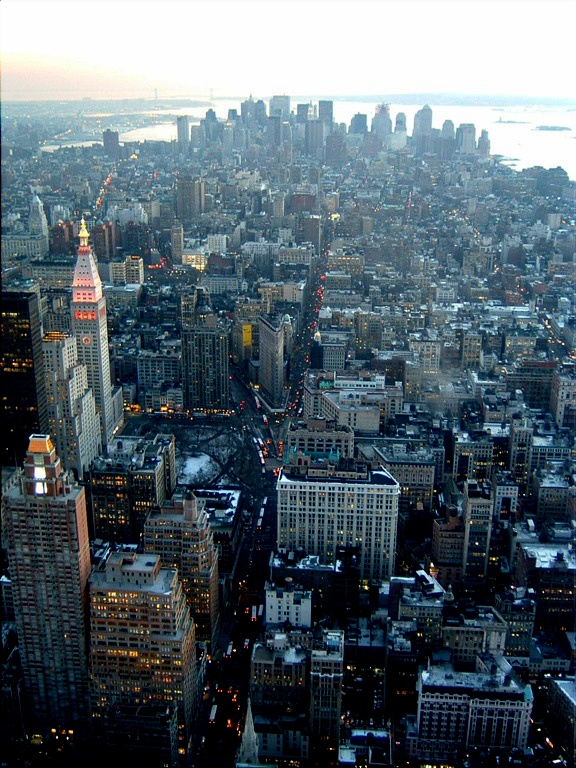
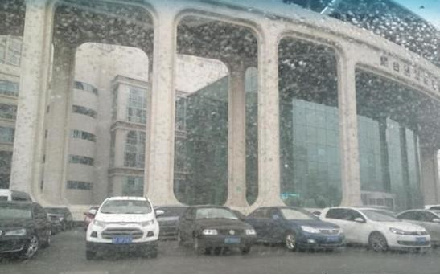

# Lightweight and Efficient Image Dehazing Network Guided by Transmission Estimation from Real-world Hazy Scenes

Python code for our Sensors 2021 paper "Z. Li, J. Zhang, R. Zhong, B. Bhanu, Y. Chen, Q. Zhang, H. Tang. Lightweight and Efficient Image Dehazing Network Guided by Transmission Estimation from Real-world Hazy Scenes."  
It can be used for image dehazing / image defogging / image enhancement on light computating load machines.

## Run
### Demo using pre-trained model

    $ sh demo -m './model' -t './testset/*' -s './result'

#### Testing on your own testset

    $ sh demo -m './model' -t './your_dataroot/*' -s ./your_output_path
## Requirement
1.  Linux
2.  python3.6, Tensorflow-gpu 1.14.0 and other common packages
3.  NVIDIA GPU + CUDA CuDNN (CUDA 10.0)

## Citing 
# Reference Paper: 
#   Z. Li, J. Zhang, R. Zhong, B. Bhanu, Y. Chen, Q. Zhang, H. Tang
#   Lightweight and Efficient Image Dehazing Network Guided by Transmission Estimation from Real-world Hazy Scenes
#   Sensors. MDPI, Basel, Switzerland. 1 February 2021 
# Any questions please contact：lizhangray@qq.com
The code is free for academic/research purpose. Please kindly cite our work in your publications if it helps your research.  

```BibTeX
@article{
  title={Lightweight and Efficient Image Dehazing Network Guided by Transmission Estimation from Real-world Hazy Scenes},
  author={Z. Li, J. Zhang, R. Zhong, B. Bhanu, Y. Chen, Q. Zhang, H. Tang},
  journal={Sensors. MDPI, Basel, Switzerland. 1 February 2021 },
  year={2021}
}
```
## Example
<div align=center>
<center class="half">
    </center></div>

<div align=center>
<center class="half">
    </center></div>
    
<div align=center>
<center class="half">
    </center></div>
    
<div align=center>
<center class="half">
    </center></div>
    
<div align=center>
<center class="half">
    </center></div>
    
<div align=center>
<center class="half">
    </center></div>


